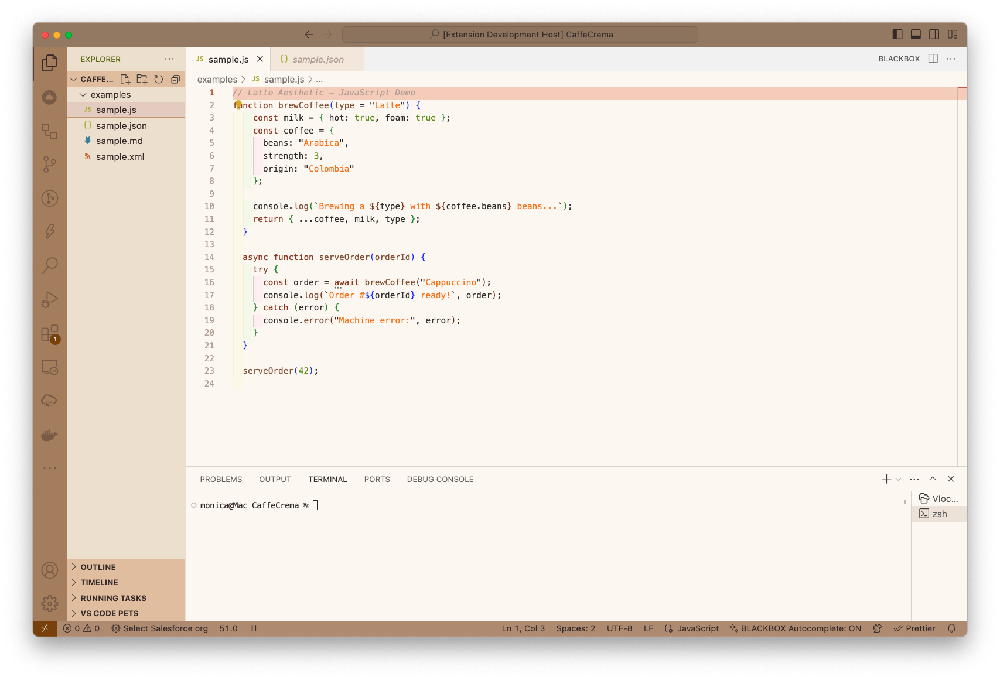
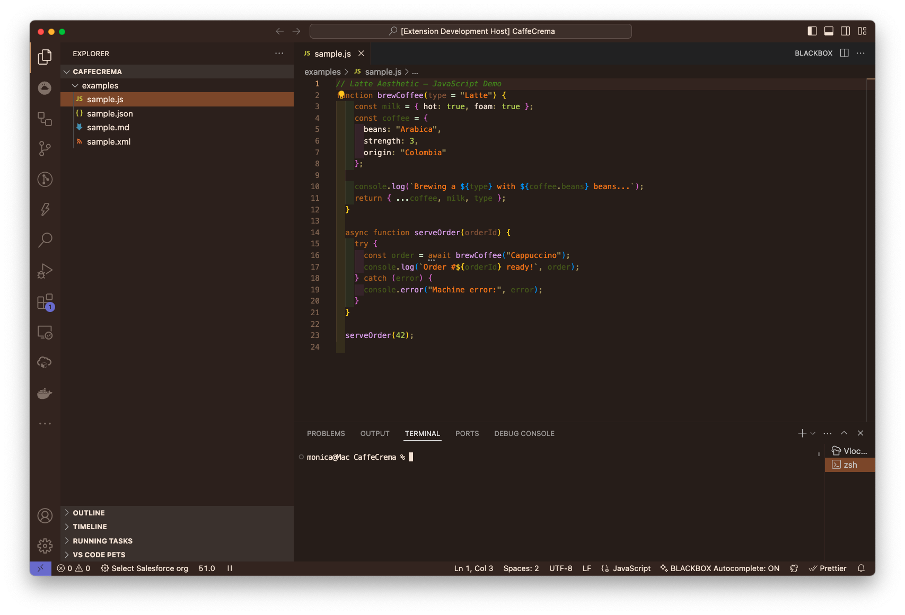
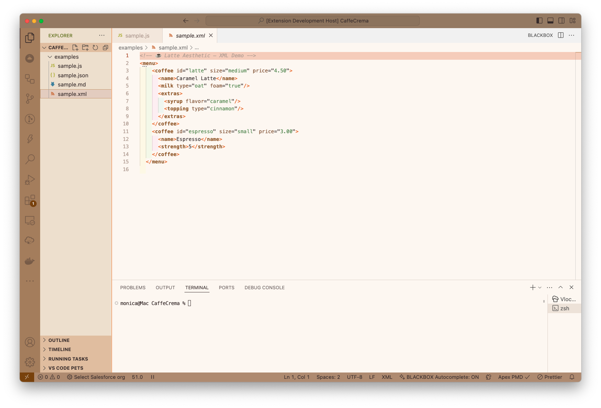
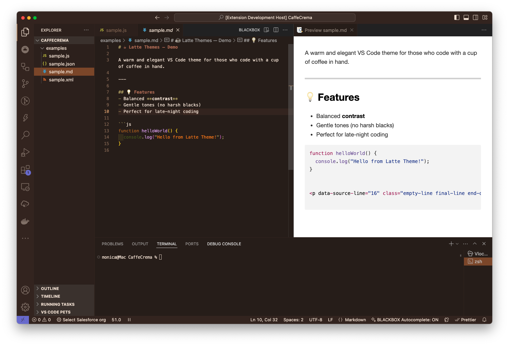
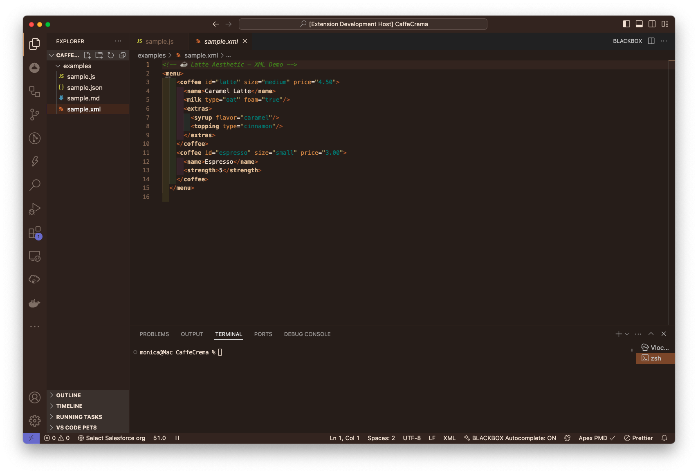

# CaffeCrema Themes — by Mónica Villarroel

A collection of **warm, elegant and coffee-inspired VS Code themes**, designed to bring calm and focus to your workspace.  
Available in **Light** and **Dark Mocha** variants.

---

## Preview

### ☀️ Caffe Crema Light
A soft creamy background with cozy beige and cappuccino tones — perfect for daylight coding.

---

### 🌙 Caffe Crema Dark
A rich mocha palette with smooth browns, caramels, and subtle gold highlights for comfortable night sessions.

---

## Features
- Balanced **contrast** for long coding sessions  
- Warm neutral tones (no harsh blacks or whites)  
- Designed for **clarity and focus**, not over-saturation  
- Optimized for XML, Apex, JavaScript, JSON, and Markdown  
- Consistent aesthetic across UI (activity bar, panels, tabs, etc.)

---

## Themes Screenshots

| Light | Dark |
|-------|------|
|  |  |
|  |  |

---

## ⚙️ Installation

### From VS Code Marketplace
1. Open **Extensions** from the Activity Bar in VS Code (`Ctrl+Shift+X` or `Cmd+Shift+X`)
2. Search for **CaffeCrema Themes**
3. Click **Install**
4. Navigate to settings > Preferences > Color Theme > CaffeCrema

---

## ☕ Author
**Mónica Villarroel**  
Salesforce DevOps Engineer & Coffee Lover  
💌 [Connect on LinkedIn](https://www.linkedin.com/in/monica-villarroel-prada) | 🌐 [Buy me a coffee](https://buymeacoffee.com/monivilla)

---

## License
MIT License © 2025 Mónica Villarroel  
Feel free to fork, remix, or adapt — just keep the credits.

---

## 💬 Feedback
If you love the vibe or have suggestions, open an issue or message me!  
I’m building this theme family to make coding a little more *beautiful and calm*.

> _“Code slow, sip often, and don’t stop dreaming.”_
